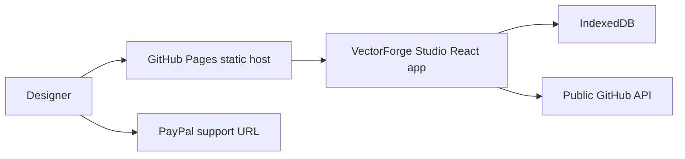

# VectorForge Studio


Browser-native vector illustration studio with serious Bezier, color, and GPU-accelerated editing.

Live site:

https://baditaflorin.github.io/vectorforge-studio/

Repository:

https://github.com/baditaflorin/vectorforge-studio

Support development:

https://www.paypal.com/paypalme/florinbadita


## Why

VectorForge Studio is a local-first Illustrator alternative for SVG authors,
icon makers, and technical illustrators who want serious browser-based vector
editing without a subscription or runtime backend.

## Features

- SVG artboard with select, node, pen, rectangle, and ellipse tools.
- Bezier anchors and handles for path editing.
- SVG import/export.
- IndexedDB local saves and offline-friendly PWA shell.
- Lazy ColorThief palette extraction from raster images.
- Public GitHub metadata, app version, and live commit shown in the status bar.
- GitHub and PayPal links visible in the published app header.

## Quickstart

```sh
npm install
make install-hooks
make dev
```

## Checks

```sh
make lint
make test
make build
make smoke
```

## Architecture



Architecture notes:

https://github.com/baditaflorin/vectorforge-studio/tree/main/docs

ADRs:

https://github.com/baditaflorin/vectorforge-studio/tree/main/docs/adr

Deployment guide:

https://github.com/baditaflorin/vectorforge-studio/blob/main/docs/deploy.md
