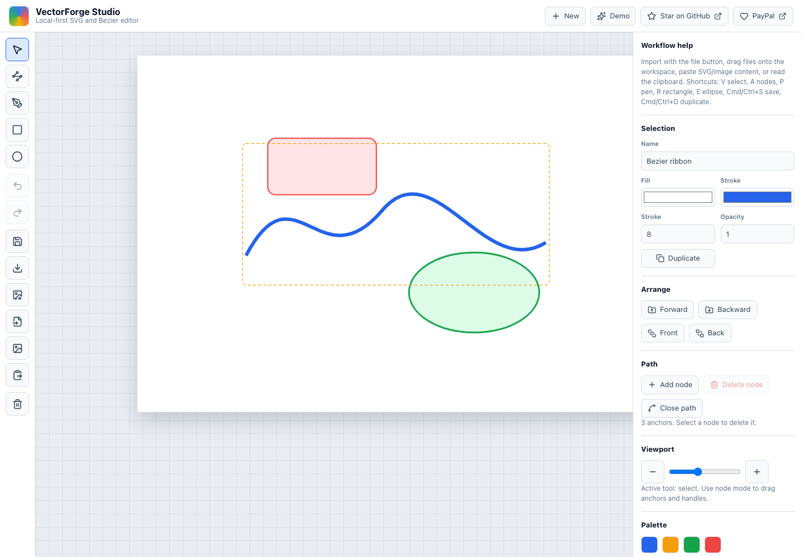
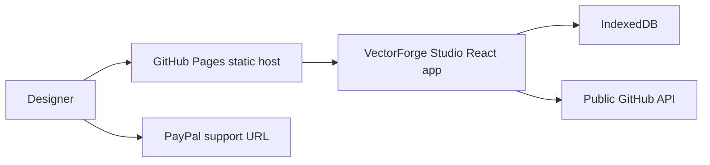

# VectorForge Studio


Browser-native vector illustration studio with serious Bezier, color, and GPU-accelerated editing.

Current release: v0.3.0.

Live site:

https://baditaflorin.github.io/vectorforge-studio/

Repository:

https://github.com/baditaflorin/vectorforge-studio

Support development:

https://www.paypal.com/paypalme/florinbadita



## Why

VectorForge Studio is a local-first Illustrator alternative for SVG authors,
icon makers, and technical illustrators who want serious browser-based vector
editing without a subscription or runtime backend.

## Features

- Verified: SVG artboard with select, node, pen, rectangle, and ellipse tools.
- Verified: Bezier anchors and handles for path editing.
- Verified: add/delete path nodes and toggle open/closed paths.
- Verified: layer ordering controls for front/back movement.
- Verified: SVG import by picker, drag/drop, paste, and multi-file batches.
- Verified: raster image palette extraction by picker, drag/drop, paste, and clipboard read.
- Verified: SVG export, PNG artboard export, SVG copy-to-clipboard, print/PDF, and share URL.
- Verified: versioned `.vectorforge.json` project export/import with document, palette, and settings.
- Verified: IndexedDB save, autosave, last-session restore, local save delete, and full local reset.
- Verified: persisted settings for zoom, autosave, last-session restore, and workflow help.
- Verified: offline-friendly PWA shell with browser cache limitations documented in `docs/privacy.md`.
- Verified: Comlink Web Worker geometry stats for element, node, and path length metrics.
- Verified: keyboard shortcuts for tools, save, duplicate, undo/redo, delete, and layer order.
- Verified: public GitHub metadata, app version, and live commit shown in the status bar.
- Verified: GitHub repository link and PayPal support link visible in the published app header.

## Limitations

- No runtime backend, auth, or cross-device sync; project files/share URLs are the cross-device path.
- No arbitrary URL import in v1 because GitHub Pages cannot bypass browser CORS for third-party files.
- No Boolean/pathfinder engine or full Illustrator compatibility yet.
- Share URLs are intentionally size-limited; use `.vectorforge.json` for larger documents.
- The PWA cache is best-effort browser storage, not a backup. Export project files for important work.

## Quickstart

```sh
npm install
make install-hooks
make dev
```

## Checks

```sh
make lint
make test
make build
make smoke
```

## Architecture



Architecture notes:

https://github.com/baditaflorin/vectorforge-studio/tree/main/docs

ADRs:

https://github.com/baditaflorin/vectorforge-studio/tree/main/docs/adr

Deployment guide:

https://github.com/baditaflorin/vectorforge-studio/blob/main/docs/deploy.md
