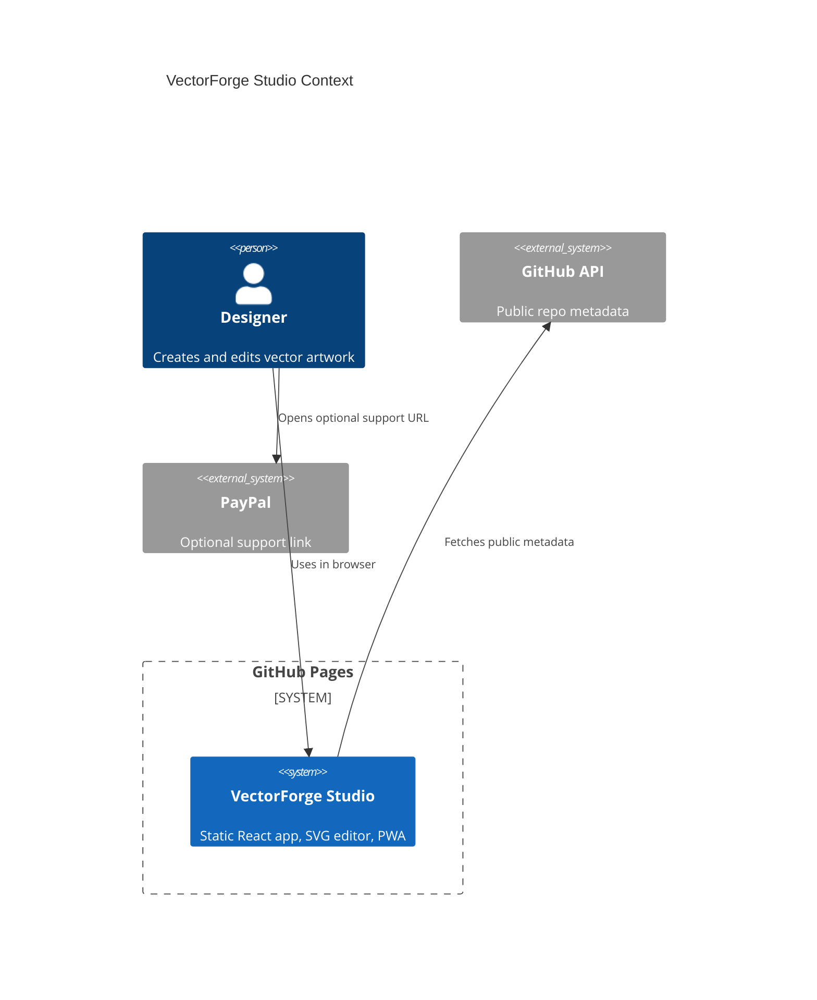
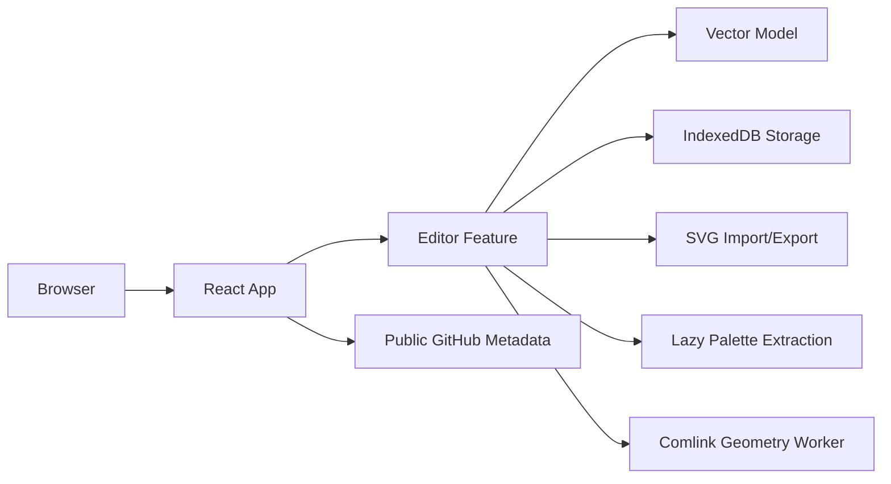

# Architecture

VectorForge Studio is a Mode A GitHub Pages app.

```mermaid
C4Context
    title VectorForge Studio Context
    Person(user, "Designer", "Creates and edits vector artwork")
    System_Boundary(pages, "GitHub Pages") {
        System(app, "VectorForge Studio", "Static React app, SVG editor, PWA")
    }
    System_Ext(github, "GitHub API", "Public repo metadata")
    System_Ext(paypal, "PayPal", "Optional support link")
    Rel(user, app, "Uses in browser")
    Rel(app, github, "Fetches public metadata")
    Rel(user, paypal, "Opens optional support URL")
```

```mermaid
flowchart LR
    Browser["Browser"]
    App["React App"]
    Editor["Editor Feature"]
    Vector["Vector Model"]
    Storage["IndexedDB Storage"]
    SVGIO["SVG Import/Export"]
    Palette["Lazy Palette Extraction"]
    Worker["Comlink Geometry Worker"]
    Repo["Public GitHub Metadata"]

    Browser --> App
    App --> Editor
    Editor --> Vector
    Editor --> Storage
    Editor --> SVGIO
    Editor --> Palette
    Editor --> Worker
    App --> Repo
```

GitHub Pages serves static files from `main` branch `/docs`. There is no
runtime server boundary in v1.
